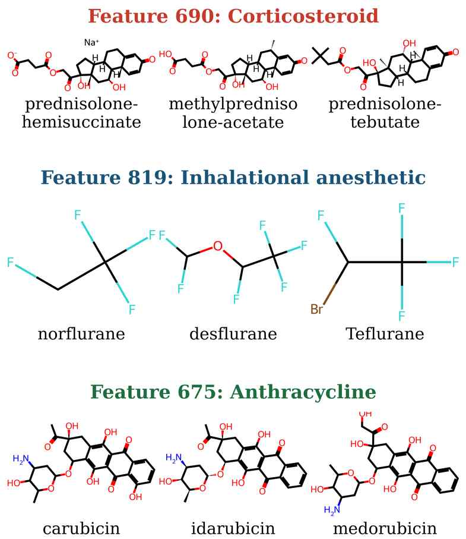

# Disentangling Chemical Representations in GNN Graph Embeddings via Sparse Autoencoders

Jinyoung Yu, Dasom Noh, Seong Hun Kim, Sunyoung Kwon · Pusan National University · **KCC 2026**
[paper (PDF, Korean)](paper/KCC2026_GNN_SAE_paper.pdf) · [slides](paper/KCC2026_GNN_SAE_slides.pdf)

We train a JumpReLU sparse autoencoder (32 → 1,024) on the graph embeddings of a pretrained molecular GNN ([GEM](https://www.nature.com/articles/s42256-021-00438-4)) over 2.2M ZINC15 molecules. The sparse features keep the information of the dense embedding and, unlike single GEM neurons, align with drug classes.

## Results

**Information is preserved.** Explained variance 0.9999 with ~52 of 1,024 features active per molecule. A frozen-feature MLP head reaches the same ROC-AUC on the original embedding, the sparse code, and the reconstruction (scaffold split, 5 seeds):

| | BBBP | ClinTox | BACE |
|---|---|---|---|
| Original GEM (32) | 0.666 | 0.702 | 0.834 |
| SAE sparse code (1024) | 0.653 | 0.690 | 0.811 |
| SAE reconstruction (32) | 0.666 | 0.691 | 0.838 |

**Single features separate drug classes; single neurons do not.** Cohen's *d* between target and non-target molecules, SAE feature vs. the best (sign-swept) GEM neuron:

| Drug class | SAE feature | GEM neuron |
|---|---|---|
| Corticosteroid (f690) | **3.90** | 1.63 |
| Inhalational anesthetic (f819) | **18.23** | 4.26 |
| Anthracycline (f675) | **6.86** | 1.95 |

Activation distributions (SAE feature vs. GEM neuron): [figures/fig3](figures/fig3_sae_feature_vs_gem_neuron.png).

**Each feature corresponds to a chemical scaffold.** The top-activating molecules of f690, f819 and f675 are prednisolone esters, fluorinated ethers, and anthraquinone-amino-sugars:

<p align="center"></p>

## Reproduce

`data/` (5.8 MB) holds the trained SAE, GEM embeddings of the three datasets, and labels. No training or PaddlePaddle needed.

```bash
pip install -r requirements.txt
python analysis/hero_features.py        # Cohen's d          → results/hero_features.json
python analysis/plot_hero.py            # Fig. 3, Fig. 4     → results/
python analysis/plot_training_curve.py  # Fig. 2             → results/
python analysis/eval_downstream.py      # Table 2 (≈5 min on GPU)
```

Training pipeline (`gem_sae/`: ZINC15 sampling → conformers → GEM layer-8 extraction → `run_paper_sae.sh`) needs [PaddleHelix GEM](https://github.com/PaddlePaddle/PaddleHelix) with `paddlehelix_gem.patch` and `sae-lens==6.39.0`. Training run: [W&B](https://wandb.ai/yoo122333-pusan-national-university/gem_sae_vocfix/runs/b1vcu50z).

Built on [SAELens](https://github.com/decoderesearch/SAELens) and PaddleHelix GEM.
